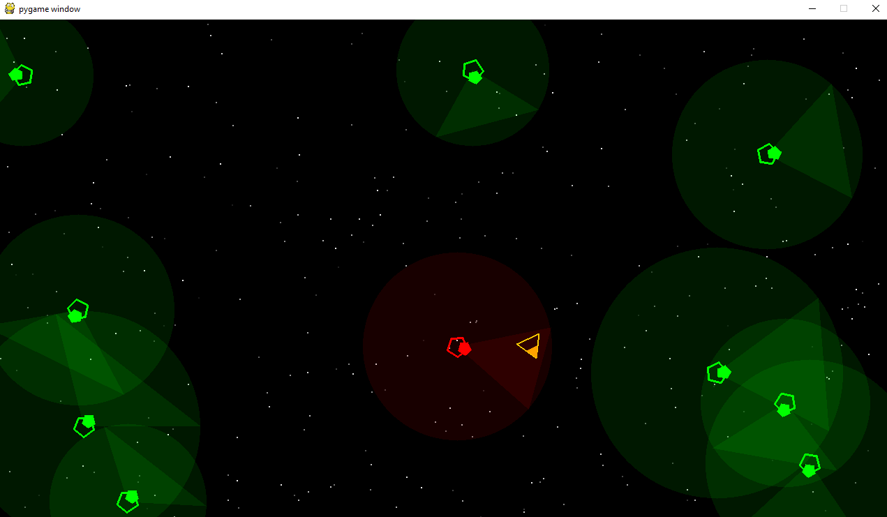

# Introdução à Matemática e Física para Jogos I 2020/2021

Este repositório serve para guardar pequenos exemplos, pedaços de código e exercícios que são necessários para as aulas de Introdução à Matemática e Física para Jogos I 2020/2021 do curso de [Videojogos][licvideo] da [ULHT].

## ship_game

Esta subdirectoria contém um projecto de um início de um jogo em que temos uma nave que se pode deslocar no espaço (vídeo disponível em https://www.youtube.com/watch?v=u2Q6n3lkCC8).
O exercício envolve programar as 4 funções dadas em game.py, de acordo com a especificação.

## Licenses

Todo o código neste repositório está disponível através da licença [GPLv3].

## Metadata

* Autor: [Diogo Andrade][]

[Diogo Andrade]:https://github.com/DiogoDeAndrade
[GPLv3]:https://www.gnu.org/licenses/gpl-3.0.en.html
[CC BY-NC-SA 4.0]:https://creativecommons.org/licenses/by-nc-sa/4.0/
[licvideo]:https://www.ulusofona.pt/licenciatura/videojogos
[Diogo Andrade]:https://github.com/DiogoDeAndrade
[ULHT]:https://www.ulusofona.pt/